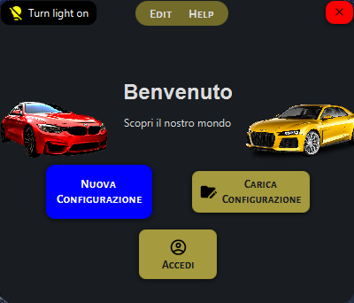
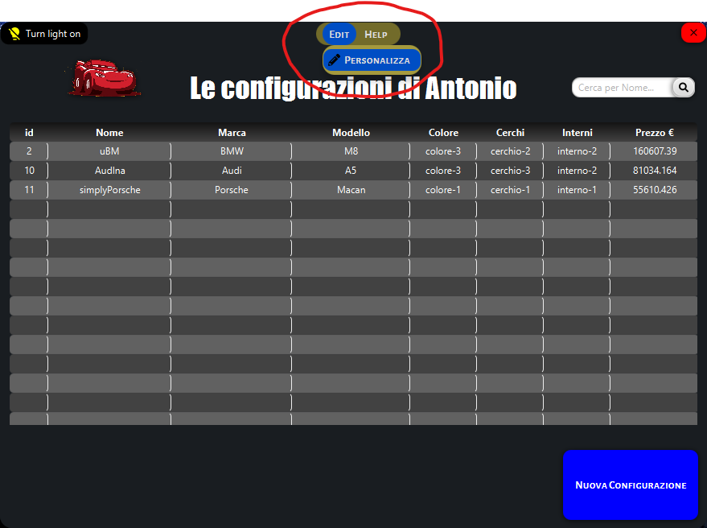
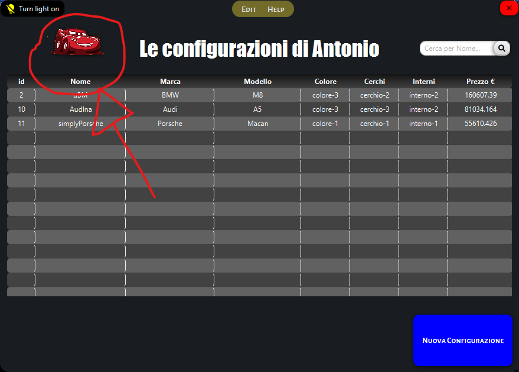

# PRO-CONF

### Con questo programma puoi:
###
* #### creare delle configurazioni di Automobili per un eventuale acquisto, esportarle in un PDF senza la necessità di inserire Dati Personali;
###
  * #### importare dei PDF di configurazioni già create;
    All'interno della cartella res del progetto è presente un [PDF d'esempio](res/esempioConfigurazione.pdf)
###
* #### creare un account per avere un resoconto delle configurazioni create nel tempo, con la possibilità di modificarle o cancellarle; 

##
### Presente la possibilità di scegliere un tema in "Edit -> Personalizza".
####

##
### Nell'Area Personale è anche presente un Minigioco da poter sfruttare nelle Micropause di tutti i giorni, usalo per accumulare punti e generare buoni sconto.
####

###

    Le password vengono conservate in modo sicuro nel Database grazie alla funzione BCrypt.